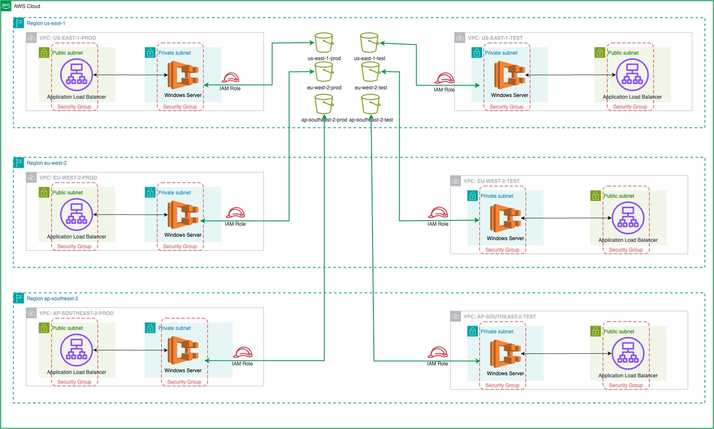

# Multi Region Infrastructure Deployment

## Infrastructure Diagram



## Understanding Repository Structure

In this Repository I got an assignment from a client to create two environments in three different regions (total 6), I assumed that I should demonstrate how this small project could function within a larger ecosystem. Therefore, I laid out a complete folder structure to support this. For this approach, Terraform Cloud and Terragrunt would be most suitable. I chose Terraform Cloud because it provides a complete UI experience. Even though Terragrunt has it's own benefits and advantages.

```

The current folder structure supporting all environments and regions:

modules/
environments/
├── ap-southeast-2/
│   ├── test/
│   └── prod/
├── eu-west-2/
│   ├── test/
│   └── prod/
└── us-east-1/
    ├── test/
    └── prod/
```

Every environment will have it's own state! This is because we want to be able to customize the environments.
The folder `/modules/` contains custom made modules that can be reused in all environments. For example, all environments could have the same EC2 Instance Configuration, therefore it can be custom defined once as a `/modules/ec2` and reused in all environments.

### Design decisions

To explain my design decision, I had to create a separate [Design Document](Design.md) file, please look into it to see more details.

### Logging in to Terraform Cloud

In order to be able to run `terraform init` and `terraform plan` locally you need to login and connect to Terraform Cloud via CLI.
To accomplish that, in your command prompt run `terraform login` and follow the procedure: https://developer.hashicorp.com/terraform/tutorials/cloud-get-started/cloud-login

## Pre-Requirements

### Terraform Version

Pre-condition for this project to run is to use have terraform version `1.9.3` or later installed on your system.
To check your version simply type `terraform -version`
If you have an older version, please follow instructions on Terraform official for upgrade.
https://developer.hashicorp.com/terraform/install

It is important to notice that in this repository we have 6 environments and each has a state. This means that we keep 6 states, one for each environment.

### Access and Authorization

To be able to initilize terraform and make changes in the AWS region "ap-southeast-2" specifically on the testing environment, change directory into `/environments/ap-southeast-2/test` and execute `terraform init`
Note, for this terraform workspace to initilize on your system, you do not require AWS credentials, your access should be authorized by your Github credentials in Terraform Cloud.
Therefore it is required that your Github Account is associated with the Terraform Workspace. Terraform Cloud will use a service account user to authenticate to AWS directly.

## How it works

Once you have been logged in and authorized, you can perform terraform plans from local console, but `terraform apply` is not allowed. It is only possible to be executed through the web console in the Terraform Cloud UI: https://app.terraform.io/app/${PROJECT}/workspaces

### How to contribute / make changes

1. Login to Terraform Clooud

```
terraform login                     # Follow the described procedure for Terraform Login
```

2. Change directory to desired environment.

```
# Assuming the desired environment is testing in the us-east-1 region

cd environments/us-east-1/test
terraform init                      # To initialize terraform state
terraform plan                      # To run terraform plan and see if there are any changes
```

3. Change to 'test' branch to start working

```
git fetch --all -prune
git checkout test
```

4. Make required changes in terraform, verify with `terraform validate` and `terraform plan`

5. Commit changes to 'test' branch. Keep in mind that all test environments are deployed from 'test' branch.

6. To deploy to any production environment you must commit changes to 'test' branch and then create a Pull Request to 'main' branch.

```
# Assuming the desired production environment is in us-east-1 region.

cd environments/us-east-1/prod
git add .
git commit -m "Commit message"
git push origin test

```

7. After pushing changes to 'test' branch, create a Pull Request in Github UI

```
1. Go to the repository page: Navigate to your repository on GitHub.
2. Switch to the test branch: You should see a prompt to create a pull request since you just pushed changes to test.
3. Click on "Compare & pull request".
4. Set the target branch: Ensure the base branch is main and the compare branch is test.
5. Add details: Provide a title and description for your pull request, explaining what changes you are proposing.
6. Submit: Click "Create Pull Request" or "Submit" to create the pull request.
```

8. Terraform Apply

```
Login to Terraform Cloud UI with your Github Account: https://app.terraform.io/app/${PROJECt}/workspaces
Whatch how your changes are planned. If the plan was successfull, click `See Details` and review everything before scrolling to the end and clicking `Confirm & Apply`.
```
