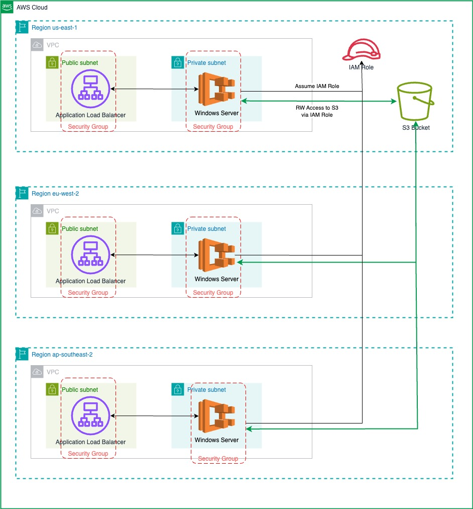

# Power Diary Assignment

### Infrastructure Diagram



### Understanding Repository Structure

Since the assignment is about creating two environments in three different regions (total 6), I assumed that I should demonstrate how this small project could function within a larger ecosystem. Therefore, I laid out a complete folder structure to support this. For this approach, Terraform Cloud and Terragrunt would be most suitable. I chose Terraform Cloud because it provides a complete UI experience. Even though Terragrunt has it's own benefits and advantages.
```

The current folder structure supporting all environments and regions:

modules/
environments/
├── ap-southeast-2/
│   ├── test/
│   └── prod/
├── eu-west-2/
│   ├── test/
│   └── prod/
└── us-east-1/
    ├── test/
    └── prod/
```
Every environment will have it's own state! This is because we want to be able to do two things. To reuse existing modules as they are accross all environments, but add custom modules or custom configurations without affecting other environments in other regions.

### Logging in to Terraform Cloud 
In order to be able to run ```terraform init``` and ```terraform plan``` locally you need to login and connect to Terraform Cloud via CLI. 
To accomplish that, in your command prompt run ```terraform login``` and follow the procedure: https://developer.hashicorp.com/terraform/tutorials/cloud-get-started/cloud-login

### Initializing Terraform
Pre-condition for this project to run is to use have terraform version ```1.9.3``` or later installed on your system. 
To check your version simply type ```terraform -version``` 
If you have an older version, please follow instructions on Terraform official for upgrade.
https://developer.hashicorp.com/terraform/install

It is important to notice that in this repository we have 6 environments and each has a state. This means that we keep 6 states, one for each environment.

#### Access and Authorization
To be able to initilize terraform and make changes in the AWS region "ap-southeast-2" specifically on the testing environment, change directory into  ```/environments/ap-southeast-2/test``` and execute ```terraform init```
Note, for this terraform workspace to initilize on your system, you do not require AWS credentials, your access should be authorized by your Github credentials in Terraform Cloud.
Therefore it is required that your Github Account is associated with the Terraform Workspace. Terraform Cloud will use a service account user to authenticate to AWS directly.

### Terraform Plan and Apply
Once you have been logged in and authorized, you can perform terraform plans from local console, but ```terraform apply``` is not allowed. It is only possible to be executed through the web console in the Terraform Cloud UI: https://app.terraform.io/app/Power-Diary/workspaces

